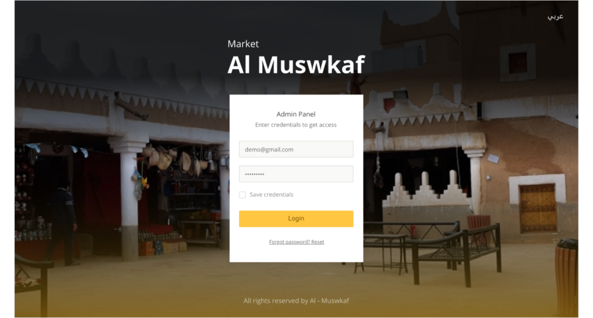
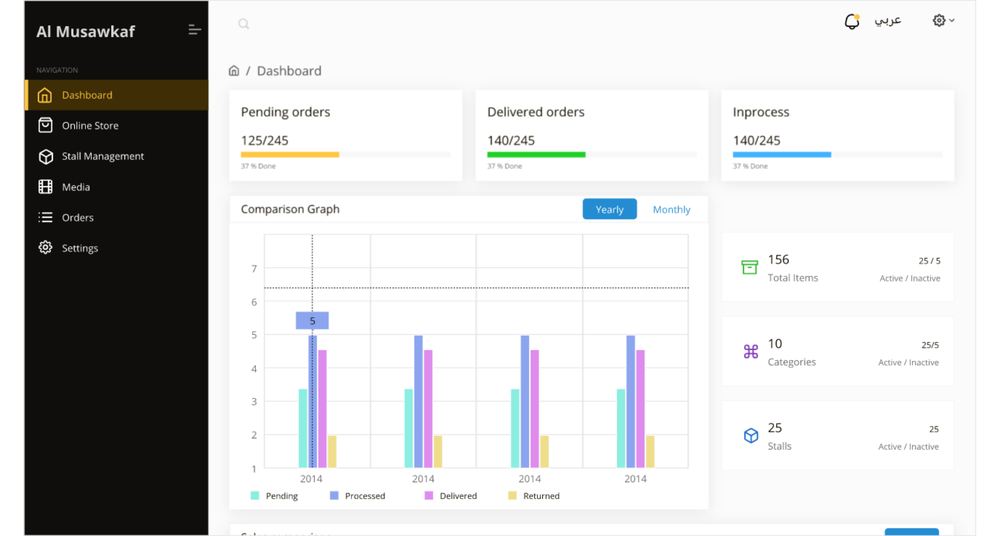
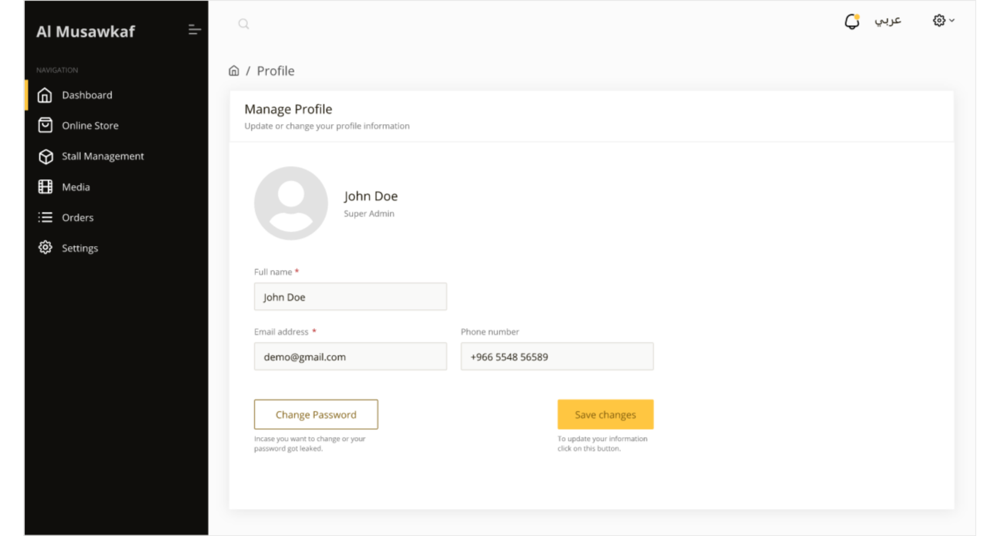
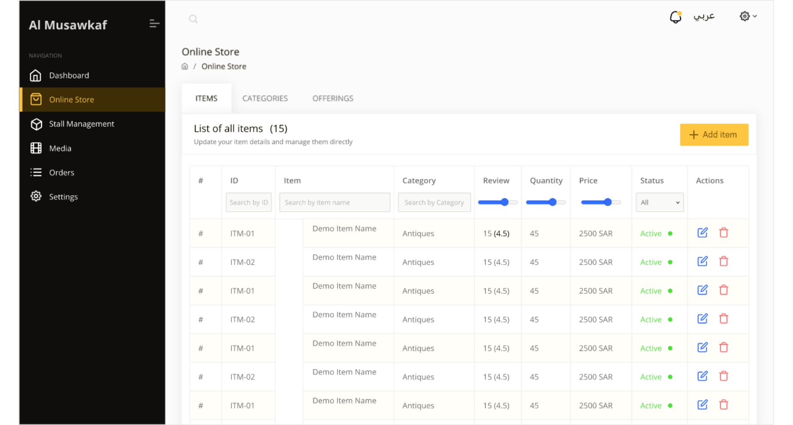
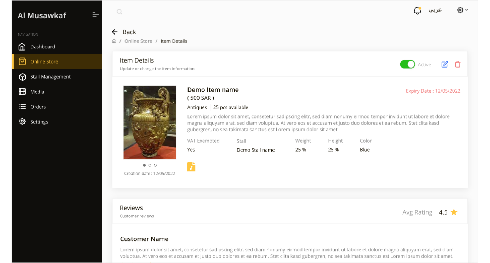
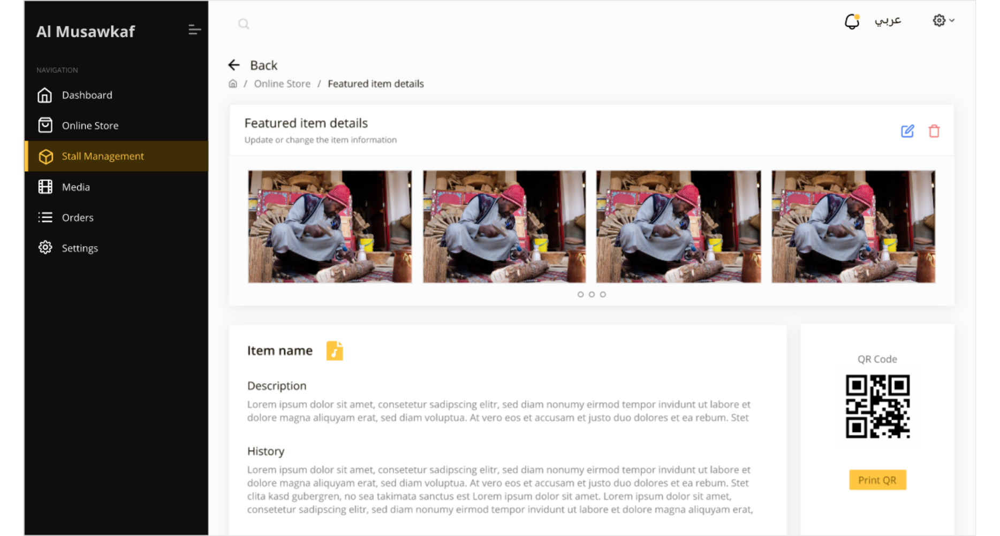

# Al-Musawkaf

INTRODUCTION

AL MUSAWKAF is an innovative AR-based museum gallery offering visitors a unique experience. With the ability to record their AR museum journey, Al Musawkaf showcases a virtual view of the traditional majlis, bringing historical scenes to life when the mobile device is pointed to specific areas. The application extends beyond the museum with a physical and online marketplace, allowing users to scan barcodes on antique items for detailed information and online purchases. Customers can track orders, make payments, while administrators have access to order management, status changes, and comprehensive reports through the dashboard

SYSTEM FEATURES

1. Authentication
2. Virtual representation of traditional majlis and historical scenes using AR.
3. Scan barcodes on physical antique items for detailed information.
4. Built-in e-commerce store.
5. Secure online payment options.
6. Comprehensive dashboard for system oversight.
7. Admin view, management, and status change for orders.
8. Detailed reports for analysis and decision-making.

TECNICALITIES/TOOLS USED

1. Flutter
2. Dart
3. Laravel
4. Reactjs
5. FCM
6. Moyasar Payment Gateway

SYSTEM SCREENSHOTS

 

PROTOTYPE LINKS

Admin Side : https://xd.adobe.com/view/c2fb45a0-a4e4-46f5-b4b9-a492ccf82957-97a8/

Client Side : https://xd.adobe.com/view/aa2e87d4-6b5f-46d6-a9b7-4199914362d6-ff7d/
